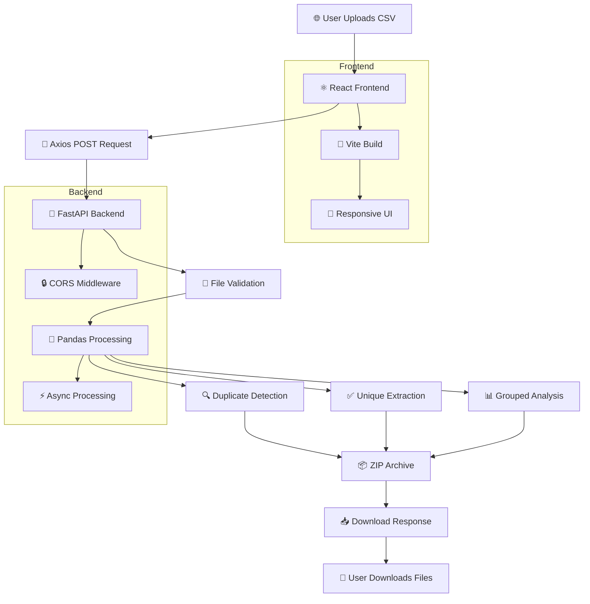
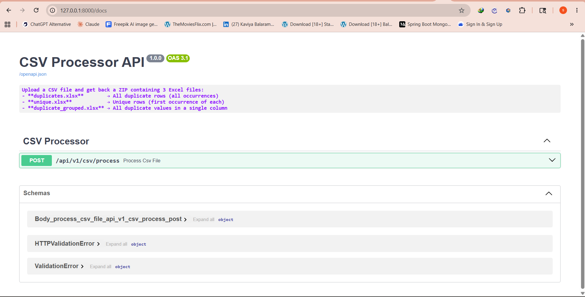
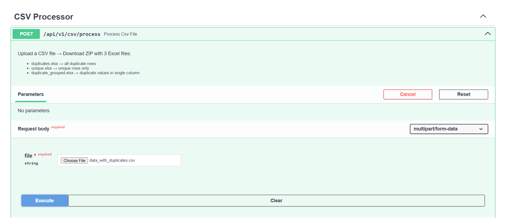
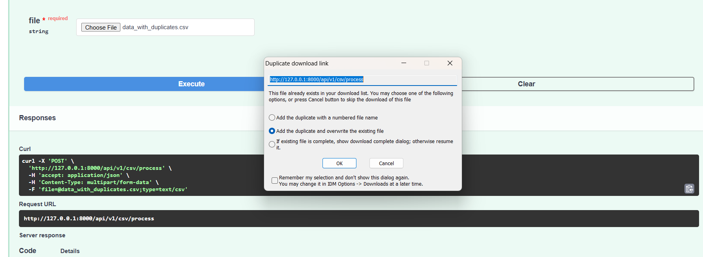

# CSV Data Duplicate Checker BACKEND README


**🔗 Live API:** [https://your-api.onrender.com/docs](https://your-api.onrender.com/docs)  
**🔗 Frontend App:** [https://csvdataduplicate.netlify.app](https://csvdataduplicate.netlify.app)  
**🔗 Frontend Repo:** [github.com/yourname/csv-frontend](https://github.com/yourname/csv-frontend)

---

## 📖 Overview

The **FastAPI backend** for the CSV Data Duplicate Checker — a high-performance Python API that receives CSV file uploads, processes them using Pandas for intelligent duplicate detection, and returns cleaned Excel files packaged in a ZIP archive.

Built with **FastAPI**, **Pandas**, and **Uvicorn**, this backend handles the heavy lifting of data processing while the React frontend provides a beautiful user interface.

---

## 🚀 Features

| Feature | Description | Status |
|---------|-------------|--------|
| **CSV Upload API** | Accepts single-file uploads via multipart/form-data | ✅ |
| **Duplicate Detection** | Identifies every repeated row using Pandas hashing | ✅ |
| **Unique Extraction** | Produces deduplicated dataset keeping first occurrences | ✅ |
| **Grouped Analysis** | Collapses duplicates into comma-separated single column | ✅ |
| **Excel Generation** | Exports 3 separate `.xlsx` files via openpyxl | ✅ |
| **ZIP Archive** | Compresses all files with DEFLATE into single download | ✅ |
| **Streaming Response** | Memory-efficient delivery without disk writes | ✅ |
| **Async Processing** | Non-blocking file handling via async/await | ✅ |
| **CORS Security** | Whitelisted cross-origin for Netlify frontend | ✅ |
| **Custom Headers** | Exposes row statistics (X-Total-Rows, etc.) | ✅ |
| **Error Handling** | Descriptive 400/500 responses with detail messages | ✅ |
| **Auto API Docs** | Interactive Swagger UI at `/docs` endpoint | ✅ |

---

## 🛠️ Tech Stack

| Technology | Purpose | Version |
|------------|---------|---------|
| **Python** | Core programming language | 3.10+ |
| **FastAPI** | Web framework & API routing | Latest |
| **Pandas** | Data processing & analysis | Latest |
| **Uvicorn** | ASGI server | Latest |
| **openpyxl** | Excel file engine | Latest |
| **python-multipart** | Multipart form parsing | Latest |
| **Pydantic** | Data validation & serialization | Latest |
| **zipfile** | ZIP compression (stdlib) | Built-in |
| **io** | Memory buffers (stdlib) | Built-in |

---

## 🏗️ Project Structure

```
📁 csv-backend/
├── 📁 app/
│   ├── 📄 __init__.py                   # 📦 Package marker
│   │                                    # Makes 'app' a Python package
│   │
│   ├── 📄 main.py                       # 🚀 FastAPI application factory
│   │                                    # Creates FastAPI instance
│   │                                    # Configures CORS middleware
│   │                                    # Mounts API routers
│   │                                    # Defines app metadata (title, version)
│   │
│   ├── 📁 routers/
│   │   ├── 📄 __init__.py               # 📦 Router package marker
│   │   └── 📄 csv_router.py             # 📡 API endpoint definitions
│   │                                    # POST /api/v1/csv/process
│   │                                    # File validation (.csv, non-empty)
│   │                                    # Calls csv_service for processing
│   │                                    # Returns StreamingResponse with ZIP
│   │                                    # Custom headers for statistics
│   │
│   ├── 📁 services/
│   │   ├── 📄 __init__.py               # 📦 Service package marker
│   │   └── 📄 csv_service.py            # 🐼 Core processing engine
│   │                                    # pd.read_csv() from BytesIO
│   │                                    # duplicated(keep=False) detection
│   │                                    # drop_duplicates() cleaning
│   │                                    # to_excel() generation × 3
│   │                                    # zipfile archive creation
│   │                                    # Statistics calculation
│   │
│   ├── 📁 schemas/
│   │   └── 📄 response_schema.py        # 📋 Pydantic models
│   │                                    # ProcessResponse model
│   │                                    # Structured JSON responses
│   │
│   └── 📁 utils/
│       └── 📄 file_utils.py             # 🛠️ Utility functions
│                                          # clear_temp() for cleanup
│                                          # Temp directory management
│
├── 📁 temp/                             # 📁 Temporary file storage (optional)
│                                          # Used if disk writes needed
│
├── 📁 output/                           # 📁 Output directory (optional)
│                                          # Debug output location
│
├── 📄 requirements.txt                  # 📦 Python dependencies
│                                          # fastapi, uvicorn, pandas
│                                          # openpyxl, python-multipart
│
├── 📄 .gitignore                        # 🚫 Git exclusions
│                                          # venv/, __pycache__/
│                                          # temp/, output/
│
└── 📄 README.md                         # 📖 This file
```

---

## 📊 System Architecture Flow



---

---

## 📈 Flow Diagram

```text
┌─────────────────┐     ┌─────────────────────┐     ┌─────────────────────┐
│    👤 User      │────▶│   ⚛️ React Frontend  │────▶│   📡 Axios Request   │
│  📤 Uploads CSV │     │   🎯 Dropzone Area   │     │   multipart/form-data│
└─────────────────┘     └─────────────────────┘     └─────────────────────┘
                                                                │
                                                                ▼
┌─────────────────┐     ┌─────────────────────┐     ┌─────────────────────┐
│    📥 Downloads │◀────│   📊 Stats Display   │◀────│   🚀 FastAPI Backend │
│   ZIP / Excel   │     │   📈 Row Counts      │     │   /api/v1/csv/process│
└─────────────────┘     └─────────────────────┘     └─────────────────────┘
                                                                │
                                                                ▼
                                                        ┌─────────────────────┐
                                                        │   🐼 Pandas Engine   │
                                                        │   csv_service.py     │
                                                        └─────────────────────┘
                                                                │
                                                                ▼
                                                        ┌─────────────────────┐
                                                        │   📦 ZIP Generator   │
                                                        │   3 Excel Files      │
                                                        └─────────────────────┘
```

---


## 🔄 How It Works

### Backend Data Flow

```
┌─────────────────────────────────────────────────────────────────────────┐
│                         BACKEND WORKFLOW                                │
└─────────────────────────────────────────────────────────────────────────┘

  1. RECEIVE REQUEST
     FastAPI receives POST /api/v1/csv/process
     Content-Type: multipart/form-data
              │
              ▼
  2. VALIDATE UPLOAD
     csv_router.py checks:
     ✓ File extension ends with .csv
     ✓ File content is not empty
     ✗ Invalid → HTTP 400 with detail message
              │
              ▼
  3. READ FILE BYTES
     async file.read() → bytes
     Wrapped in BytesIO (no disk I/O)
              │
              ▼
  4. PANDAS PROCESSING
     csv_service.py:
     ├── pd.read_csv(BytesIO) → DataFrame
     ├── df.duplicated(keep=False) → boolean mask
     ├── df[mask] → all duplicate rows
     └── df.drop_duplicates(keep='first') → unique rows
              │
              ▼
  5. GENERATE OUTPUTS
     3 DataFrames → 3 Excel buffers:
     ├─ duplicates.xlsx      (all duplicate occurrences)
     ├─ unique.xlsx          (cleaned dataset)
     └─ duplicate_grouped.xlsx (single-column comma view)
              │
              ▼
  6. CREATE ZIP
     zipfile.ZipFile(zip_buffer, "w", DEFLATED)
     writestr() for each Excel buffer
     → Single compressed archive
              │
              ▼
  7. STREAM RESPONSE
     StreamingResponse(zip_buffer, media_type="application/zip")
     Headers:
       Content-Disposition: inline; filename=processed_output.zip
       X-Total-Rows: <count>
       X-Duplicate-Rows: <count>
       X-Unique-Rows: <count>
              │
              ▼
  8. CLIENT RECEIVES
     Frontend parses headers → displays stats
     Creates blob URLs → renders download cards
```

---

## 🐼 Pandas Concepts Used

### 📥 read_csv()

Reads CSV directly from memory using `BytesIO` — no disk writes.

```python
import pandas as pd
from io import BytesIO

df = pd.read_csv(BytesIO(file_bytes))
```

| Parameter | Default | Our Usage |
|-----------|---------|---------|
| `filepath_or_buffer` | Required | `BytesIO(file_bytes)` |
| `sep` | `,` | Default (comma) |
| `header` | `infer` | Auto-detects header row |
| `encoding` | `utf-8` | Default |

**Why used:** Processing entirely in RAM is 10-100x faster than disk I/O and essential for serverless deployments like Render where filesystem is ephemeral.

---

### 🔍 duplicated()

Returns a boolean Series marking duplicate rows.

```python
# Mark ALL occurrences (first + all repeats)
duplicate_mask = df.duplicated(keep=False)
df_duplicates = df[duplicate_mask].reset_index(drop=True)
```

| Parameter | Value | Effect |
|-----------|-------|--------|
| `keep` | `'first'` | Mark duplicates except first |
| `keep` | `'last'` | Mark duplicates except last |
| `keep` | `False` | **Mark ALL duplicates** ← Used |

**Why used:** `keep=False` ensures users see **every** row that is duplicated, not just the extras — critical for audit trails.

---

### ✨ drop_duplicates()

Removes duplicate rows, keeping only the first occurrence.

```python
# Keep first, drop subsequent
df_unique = df.drop_duplicates(keep='first').reset_index(drop=True)
```

**Why used:** Produces the clean dataset users need for downstream workflows (CRM imports, mailing lists, analytics).

---

### 📊 DataFrame

The core 2D labeled data structure.

```python
# Get dimensions
rows, cols = df.shape

# Row count
len(df)

# Column names
df.columns.tolist()
```

**Why used:** DataFrames store data in contiguous C arrays, enabling vectorized operations that run at compiled speed instead of interpreted Python loops.

---

### 🔎 Filtering (Boolean Indexing)

```python
mask = df.duplicated(keep=False)
df_duplicates = df[mask]  # Vectorized — no Python loops
```

**Why used:** Boolean indexing is a single-pass C operation. A Python `for` loop would be O(n²); Pandas does this in O(n) via hashing.

---

### 🔢 Indexing

```python
# Reset index after filtering to get clean 0-based index
df_clean = df_filtered.reset_index(drop=True)
```

**Why used:** After dropping rows, the original index has gaps (0, 2, 5, 7). `reset_index` rebuilds a clean sequence. `drop=True` prevents the old index from becoming a column.

---

### 📤 CSV Export

```python
# Write to memory buffer (not disk)
csv_buffer = StringIO()
df.to_csv(csv_buffer, index=False)
```

**Why used:** `StringIO` keeps CSV data in RAM for immediate streaming to the client without filesystem overhead.

---

### 📊 Excel Export

```python
excel_buf = BytesIO()
df.to_excel(excel_buf, index=False)
excel_buf.seek(0)
```

**Why used:** `openpyxl` engine writes `.xlsx` format. `index=False` omits the DataFrame index column for cleaner output files.

---

## 📡 API Documentation

### Endpoint

```http
POST /api/v1/csv/process
```

### Request

| Property | Value |
|----------|-------|
| Method | `POST` |
| Content-Type | `multipart/form-data` |
| Body | `file: <CSV_FILE>` (required, `.csv` only) |

### cURL Example

```bash
# Upload CSV and download ZIP
curl -X POST "https://your-api.onrender.com/api/v1/csv/process" \
  -F "file=@data.csv" \
  -H "Accept: application/zip" \
  --output result.zip
```

### Python Example (requests)

```python
import requests

url = "https://your-api.onrender.com/api/v1/csv/process"
files = {"file": open("data.csv", "rb")}

response = requests.post(url, files=files)

# Extract statistics from headers
print(response.headers["X-Total-Rows"])      # 15420
print(response.headers["X-Duplicate-Rows"])  # 1840
print(response.headers["X-Unique-Rows"])       # 13580

# Save ZIP file
with open("output.zip", "wb") as f:
    f.write(response.content)
```

### Response

#### ✅ Success (200 OK)

```http
HTTP/1.1 200 OK
Content-Type: application/zip
Content-Disposition: inline; filename=processed_output.zip
X-Total-Rows: 15420
X-Duplicate-Rows: 1840
X-Unique-Rows: 13580

<binary ZIP data>
```

#### 📦 ZIP Contents

| File | Description |
|------|-------------|
| `duplicates.xlsx` | All rows appearing more than once (every occurrence) |
| `unique.xlsx` | Deduplicated dataset — first occurrence kept |
| `duplicate_grouped.xlsx` | Unique duplicates collapsed into comma-separated single column |

#### ❌ Error Responses

| Status | Cause | Response Body |
|--------|-------|---------------|
| `400` | Invalid file type | `{"detail":"Only .csv files are allowed"}` |
| `400` | Empty file | `{"detail":"Uploaded file is empty"}` |
| `500` | Processing failure | `{"detail":"Processing failed: <error>"}` |

---

## 💻 Installation & Setup

### Prerequisites

| Requirement | Version |
|-------------|---------|
| Python | 3.10+ |
| pip | Latest |
| Git | Latest |

### 1️⃣ Clone the Repository

```bash
git clone https://github.com/yourname/csv-backend.git
cd csv-backend
```

### 2️⃣ Create Virtual Environment

```bash
# Create venv
python -m venv venv

# Windows activation
venv\\Scripts\\activate

# macOS/Linux activation
source venv/bin/activate
```

### 3️⃣ Install Dependencies

```bash
pip install -r requirements.txt
```

### 📦 Requirements (requirements.txt)

```txt
fastapi
uvicorn[standard]
pandas
openpyxl
python-multipart
```

### 4️⃣ Run Development Server

```bash
# With auto-reload (development)
uvicorn app.main:app --reload

# Without reload (production-like)
uvicorn app.main:app --host 0.0.0.0 --port 8000

# Open interactive docs
# http://localhost:8000/docs
# http://localhost:8000/redoc
```

---

## 🚀 Deployment

### Render Deployment

1. **Push code to GitHub**
```bash
git add .
git commit -m "Ready for deployment"
git push origin main
```

2. **Create Web Service on Render**
   - Go to [render.com](https://render.com)
   - Click "New" → "Web Service"
   - Connect your GitHub repo

3. **Configuration**
   | Setting | Value |
   |---------|-------|
   | Runtime | Python 3 |
   | Build Command | `pip install -r requirements.txt` |
   | Start Command | `uvicorn app.main:app --host 0.0.0.0 --port $PORT` |

4. **Environment Variables**
   | Variable | Value |
   |----------|-------|
   | `PYTHON_VERSION` | `3.10.0` |

5. **Auto-deploy**
   - Render deploys automatically on every git push

### Production CORS Configuration

```python
from fastapi.middleware.cors import CORSMiddleware

app.add_middleware(
    CORSMiddleware,
    allow_origins=["https://csvdataduplicate.netlify.app"],  # Your frontend URL
    allow_credentials=True,
    allow_methods=["*"],
    allow_headers=["*"],
    expose_headers=["X-Total-Rows", "X-Duplicate-Rows", "X-Unique-Rows"],
)
```

**⚠️ Security Warning:** Never use `allow_origins=["*"]` with `allow_credentials=True` in production.

---

## 🚧 Challenges Faced

| Challenge | Solution |
|-----------|----------|
| **CORS Issues** | Added FastAPI CORSMiddleware with explicit origin whitelisting. Preflight requests handled automatically. |
| **Render Cold Starts** | Free tier spins down after 15 min of inactivity. First request takes 20-30s. Added descriptive loading state in frontend. |
| **CSV Parsing Errors** | Wrapped `pd.read_csv()` in try/except. Returns HTTP 500 with message advising UTF-8 encoding and delimiter check. |
| **File Handling** | Used `BytesIO` for 100% in-memory processing. No disk writes — critical for ephemeral serverless filesystems. |
| **Memory Efficiency** | Pandas' dense C-array storage keeps memory usage low. Processed 100k+ row files within Render's 512MB free tier. |
| **ZIP Streaming** | Used `StreamingResponse` instead of loading entire ZIP into memory. Streams bytes directly from buffer to client. |

---

## 🔮 Future Improvements

| Feature | Description | Priority |
|---------|-------------|----------|
| **🔐 Authentication** | JWT-based auth with signup/login. Row-level security per user | High |
| **💾 Database Storage** | PostgreSQL for persistent file metadata and upload history | High |
| **📊 Dashboard Analytics** | Charts showing duplicate patterns, column distributions | Medium |
| **🤖 AI CSV Insights** | LLM integration to suggest cleaning rules and detect anomalies | Medium |
| **📜 User History** | Track past uploads, statistics, re-download links | Medium |
| **⚡ Background Processing** | Celery + Redis for large file async processing with progress | Medium |
| **☁️ Cloud Storage** | S3 integration for persistent file storage | Low |
| **📧 Email Notifications** | Send download links via email for large files | Low |

---

## 📸 API Testing Screenshots

| Screen | Preview |
|--------|---------|
| **Swagger UI** |  |
| **POST Request** |  |
| **Response Headers** |  |

> Add your screenshots to `docs/screenshots/` folder

---

## 👤 Author

<div align="center">

**Your Name**

Backend Developer | Python · FastAPI · Pandas

[](https://github.com/yourname)
[](https://linkedin.com/in/yourname)
[](https://yourportfolio.com)

</div>

---

## 📄 License

This project is licensed under the **MIT License** - see the [LICENSE](LICENSE) file for details.

---

<div align="center">

⭐ Star this repo if you find it helpful!

🚀 Built with ❤️ using **Python**, **FastAPI**, and **Pandas**

</div>
'''
