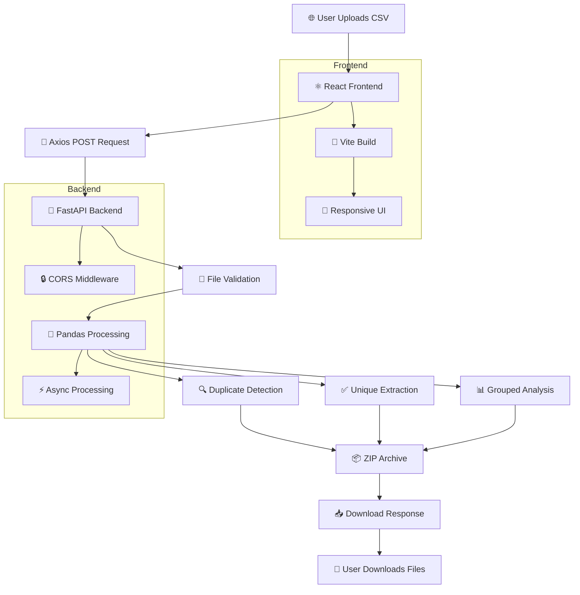

readme_content = '''# CSV Data Duplicate Checker


**📚 Live Demo:** [https://csvdataduplicate.netlify.app](https://csvdataduplicate.netlify.app)

---

## 📖 Overview

A full-stack **CSV Data Duplicate Checker** that intelligently detects, analyzes, and cleans duplicate records from CSV datasets. Users upload CSV files through a modern React frontend, the FastAPI backend processes them using Pandas, and returns cleaned Excel files packaged in a ZIP archive.

This project demonstrates production-grade full-stack development with **React + Vite** on the frontend and **FastAPI + Pandas** on the backend, deployed on **Netlify** and **Render** respectively.

---

## 📊 System Architecture Flow



---

## 📈 Flow Diagram

```text
┌─────────────────┐     ┌─────────────────────┐     ┌─────────────────────┐
│    👤 User      │────▶│   ⚛️ React Frontend  │────▶│   📡 Axios Request   │
│  📤 Uploads CSV │     │   🎯 Dropzone Area   │     │   multipart/form-data│
└─────────────────┘     └─────────────────────┘     └─────────────────────┘
                                                                │
                                                                ▼
┌─────────────────┐     ┌─────────────────────┐     ┌─────────────────────┐
│    📥 Downloads │◀────│   📊 Stats Display   │◀────│   🚀 FastAPI Backend │
│   ZIP / Excel   │     │   📈 Row Counts      │     │   /api/v1/csv/process│
└─────────────────┘     └─────────────────────┘     └─────────────────────┘
                                                                │
                                                                ▼
                                                        ┌─────────────────────┐
                                                        │   🐼 Pandas Engine   │
                                                        │   csv_service.py     │
                                                        └─────────────────────┘
                                                                │
                                                                ▼
                                                        ┌─────────────────────┐
                                                        │   📦 ZIP Generator   │
                                                        │   3 Excel Files      │
                                                        └─────────────────────┘
```

---

## 🚀 Features

### 📤 CSV Processing

| Feature | Description | Status |
|---------|-------------|--------|
| **CSV Upload** | Drag & drop interface with file type validation | ✅ |
| **Duplicate Detection** | Identifies all repeated rows using Pandas | ✅ |
| **Unique Extraction** | Generates clean dataset with first occurrences only | ✅ |
| **Grouped Analysis** | Collapses duplicates into comma-separated single column | ✅ |
| **Excel Generation** | Exports 3 separate `.xlsx` files | ✅ |
| **ZIP Download** | Packages all files into compressed archive | ✅ |

### 🌐 API & Infrastructure

| Feature | Description | Status |
|---------|-------------|--------|
| **FastAPI REST API** | Async endpoints with automatic OpenAPI docs | ✅ |
| **Real-time Processing** | Instant statistics display without page reload | ✅ |
| **Responsive UI** | Mobile-first design with glassmorphism effects | ✅ |
| **CORS Security** | Whitelisted cross-origin communication | ✅ |
| **Streaming Response** | Memory-efficient ZIP delivery | ✅ |

---

## 🛠️ Tech Stack

### ⚛️ Frontend

| Technology | Purpose | Version |
|------------|---------|---------|
| **React** | UI component library | 19.x |
| **Vite** | Build tool & dev server | 8.x |
| **Axios** | HTTP client for API calls | 1.16.x |
| **react-dropzone** | Drag & drop file upload | 15.x |
| **lucide-react** | Icon library | 1.16.x |
| **CSS** | Custom styling with CSS variables | - |

### 🐍 Backend

| Technology | Purpose | Version |
|------------|---------|---------|
| **Python** | Core programming language | 3.10+ |
| **FastAPI** | Web framework & API routing | Latest |
| **Pandas** | Data processing & analysis | Latest |
| **Uvicorn** | ASGI server | Latest |
| **openpyxl** | Excel file engine | Latest |
| **python-multipart** | Multipart form parsing | Latest |

---

## 🏗️ Project Structure

### ⚛️ Frontend Structure

```
📁 csv-frontend/
├── 📁 public/
│   └── 📄 favicon.svg
├── 📁 src/
│   ├── 📁 components/
│   │   ├── 📄 DropZoneArea.jsx          # 🎯 Drag & drop upload zone
│   │   ├── 📄 FileDownloads.jsx         # 💾 Download cards & ZIP button
│   │   ├── 📄 Header.jsx                # 🎨 App title & description
│   │   └── 📄 StatsDashboard.jsx        # 📊 Processing statistics display
│   ├── 📁 assets/
│   │   └── 📄 (static files)
│   ├── 📄 App.jsx                       # 🏠 Main app container (state management)
│   ├── 📄 App.css                       # 🎨 Component-specific styles
│   ├── 📄 index.css                     # 🌐 Global theme & CSS variables
│   └── 📄 main.jsx                      # ⚛️ React entry point (ReactDOM)
├── 📄 index.html                        # 📄 HTML template
├── 📄 vite.config.js                    # ⚡ Vite configuration
├── 📄 package.json                      # 📦 Dependencies & scripts
├── 📄 eslint.config.js                  # 🔍 ESLint rules
└── 📄 README.md                         # 📖 Frontend documentation
```

### 🐍 Backend Structure

```
📁 csv-backend/
├── 📁 app/
│   ├── 📄 __init__.py                   # 📦 Package marker
│   ├── 📄 main.py                       # 🚀 FastAPI app instance & CORS config
│   ├── 📁 routers/
│   │   ├── 📄 __init__.py
│   │   └── 📄 csv_router.py             # 📡 /api/v1/csv/process endpoint
│   ├── 📁 services/
│   │   ├── 📄 __init__.py
│   │   └── 📄 csv_service.py            # 🐼 Pandas processing engine
│   ├── 📁 schemas/
│   │   └── 📄 response_schema.py        # 📋 Pydantic response models
│   └── 📁 utils/
│       └── 📄 file_utils.py             # 🛠️ Temp directory helpers
├── 📁 temp/                             # 📁 Temporary storage (optional)
├── 📁 output/                           # 📁 Output directory (optional)
├── 📄 requirements.txt                  # 📦 Python dependencies
├── 📄 .gitignore                        # 🚫 Git exclusions
└── 📄 README.md                         # 📖 Backend documentation
```

---

## 🔄 Project Workflow

### Step-by-Step Internal Flow

```
┌─────────────────────────────────────────────────────────────────────────┐
│                      PROJECT WORKFLOW                                   │
└─────────────────────────────────────────────────────────────────────────┘

  1. USER UPLOADS CSV
     User drags CSV file onto react-dropzone area
     File validated by MIME type (text/csv)
              │
              ▼
  2. FRONTEND SENDS API REQUEST
     Axios creates FormData with File object
     POST to /api/v1/csv/process
     Content-Type: multipart/form-data
     responseType: 'blob' (for binary ZIP)
              │
              ▼
  3. BACKEND RECEIVES FILE
     FastAPI UploadFile descriptor streams multipart data
     Router validates .csv extension
     Rejects empty files → HTTP 400
              │
              ▼
  4. PANDAS PROCESSES CSV
     pd.read_csv(BytesIO(file_bytes)) → DataFrame
     In-memory processing (no disk I/O)
              │
              ▼
  5. DUPLICATE DATA IDENTIFIED
     mask = df.duplicated(keep=False)
     Captures ALL occurrences (first + repeats)
     df_duplicates = df[mask]
              │
              ▼
  6. FILES GENERATED
     ├─ duplicates.xlsx      → All duplicate rows
     ├─ unique.xlsx          → Clean dataset (first occurrence kept)
     └─ duplicate_grouped.xlsx → Single-column comma-separated view
              │
              ▼
  7. RESPONSE RETURNED
     StreamingResponse(zip_buffer, media_type="application/zip")
     Custom headers:
       X-Total-Rows: 15420
       X-Duplicate-Rows: 1840
       X-Unique-Rows: 13580
              │
              ▼
  8. USER DOWNLOADS FILES
     Frontend parses headers → displays statistics
     Creates object URLs from blob
     Renders download cards for each file
     ZIP download button for all files
```

---

## 🐼 Pandas Concepts Used

### 📥 read_csv()

Reads CSV data directly from memory using `BytesIO` — no disk writes.

```python
import pandas as pd
from io import BytesIO

df = pd.read_csv(BytesIO(file_bytes))
```

**Why used:** Processing entirely in RAM is 10-100x faster than disk I/O and essential for serverless deployments like Render where filesystem is ephemeral.

---

### 🔍 duplicated()

Returns a boolean Series marking duplicate rows.

```python
# Mark ALL occurrences (first + all repeats)
duplicate_mask = df.duplicated(keep=False)
df_duplicates = df[duplicate_mask].reset_index(drop=True)
```

| Parameter | Value | Effect |
|-----------|-------|--------|
| `keep` | `'first'` | Mark duplicates except first |
| `keep` | `'last'` | Mark duplicates except last |
| `keep` | `False` | **Mark ALL duplicates** ← Used |

**Why used:** `keep=False` ensures users see **every** row that is duplicated, not just the extras — critical for audit trails.

---

### ✨ drop_duplicates()

Removes duplicate rows, keeping only the first occurrence.

```python
# Keep first, drop subsequent
df_unique = df.drop_duplicates(keep='first').reset_index(drop=True)
```

**Why used:** Produces the clean dataset users need for downstream workflows (CRM imports, mailing lists, analytics).

---

### 📊 DataFrame

The core 2D labeled data structure.

```python
# Get dimensions
rows, cols = df.shape

# Row count
len(df)

# Column names
df.columns.tolist()
```

**Why used:** DataFrames store data in contiguous C arrays, enabling vectorized operations that run at compiled speed instead of interpreted Python loops.

---

### 🔎 Filtering (Boolean Indexing)

```python
mask = df.duplicated(keep=False)
df_duplicates = df[mask]  # Vectorized — no Python loops
```

**Why used:** Boolean indexing is a single-pass C operation. A Python `for` loop would be O(n²); Pandas does this in O(n) via hashing.

---

### 🔢 Indexing

```python
# Reset index after filtering to get clean 0-based index
df_clean = df_filtered.reset_index(drop=True)
```

**Why used:** After dropping rows, the original index has gaps (0, 2, 5, 7). `reset_index` rebuilds a clean sequence. `drop=True` prevents the old index from becoming a column.

---

### 📤 CSV Export

```python
# Write to memory buffer (not disk)
csv_buffer = StringIO()
df.to_csv(csv_buffer, index=False)
```

**Why used:** `StringIO` keeps CSV data in RAM for immediate streaming to the client without filesystem overhead.

---

### 📊 Excel Export

```python
excel_buf = BytesIO()
df.to_excel(excel_buf, index=False)
excel_buf.seek(0)
```

**Why used:** `openpyxl` engine writes `.xlsx` format. `index=False` omits the DataFrame index column for cleaner output files.

---

## 📡 API Documentation

### Endpoint

```http
POST /api/v1/csv/process
```

### Request

| Property | Value |
|----------|-------|
| Method | `POST` |
| Content-Type | `multipart/form-data` |
| Body | `file: <CSV_FILE>` (required, `.csv` only) |

### cURL Example

```bash
# Upload CSV and download ZIP
curl -X POST "https://your-api.onrender.com/api/v1/csv/process" \
  -F "file=@data.csv" \
  -H "Accept: application/zip" \
  --output result.zip
```

### Python Example (requests)

```python
import requests

url = "https://your-api.onrender.com/api/v1/csv/process"
files = {"file": open("data.csv", "rb")}

response = requests.post(url, files=files)

# Extract statistics from headers
print(response.headers["X-Total-Rows"])      # 15420
print(response.headers["X-Duplicate-Rows"])  # 1840
print(response.headers["X-Unique-Rows"])       # 13580

# Save ZIP file
with open("output.zip", "wb") as f:
    f.write(response.content)
```

### Response

#### ✅ Success (200 OK)

```http
HTTP/1.1 200 OK
Content-Type: application/zip
Content-Disposition: inline; filename=processed_output.zip
X-Total-Rows: 15420
X-Duplicate-Rows: 1840
X-Unique-Rows: 13580

<binary ZIP data>
```

#### 📦 ZIP Contents

| File | Description |
|------|-------------|
| `duplicates.xlsx` | All rows appearing more than once (every occurrence) |
| `unique.xlsx` | Deduplicated dataset — first occurrence kept |
| `duplicate_grouped.xlsx` | Unique duplicates collapsed into comma-separated single column |

#### ❌ Error Responses

| Status | Cause | Response Body |
|--------|-------|---------------|
| `400` | Invalid file type | `{"detail":"Only .csv files are allowed"}` |
| `400` | Empty file | `{"detail":"Uploaded file is empty"}` |
| `500` | Processing failure | `{"detail":"Processing failed: <error>"}` |

---

## 💻 Installation & Setup

### Prerequisites

| Requirement | Version |
|-------------|---------|
| Node.js | 18+ |
| Python | 3.10+ |
| npm or yarn | Latest |
| Git | Latest |

### 1️⃣ Clone the Repository

```bash
git clone https://github.com/yourname/csv-duplicate-checker.git
cd csv-duplicate-checker
```

### 2️⃣ Frontend Setup

```bash
cd csv-frontend

# Install dependencies
npm install

# Start development server
npm run dev

# Open http://localhost:5173
```

### 3️⃣ Backend Setup

```bash
cd csv-backend

# Create virtual environment
python -m venv venv

# Windows
venv\\Scripts\\activate

# macOS/Linux
source venv/bin/activate

# Install dependencies
pip install -r requirements.txt

# Run development server
uvicorn app.main:app --reload

# Open interactive docs at http://localhost:8000/docs
```

### 📦 Requirements (requirements.txt)

```txt
fastapi
uvicorn[standard]
pandas
openpyxl
python-multipart
```

---

## 🚀 Deployment

### ⚛️ Frontend (Netlify)

1. **Push frontend code** to GitHub
2. **Connect repo** to [Netlify](https://netlify.com)
3. **Build settings:**
   - Build command: `npm run build`
   - Publish directory: `dist`
4. **Environment variables:**
   - `VITE_API_URL`: `https://your-api.onrender.com`
5. **Deploy** — auto-deploys on every git push

### 🐍 Backend (Render)

1. **Push backend code** to GitHub
2. **Create Web Service** on [Render](https://render.com)
3. **Runtime:** Python 3
4. **Build command:** `pip install -r requirements.txt`
5. **Start command:** `uvicorn app.main:app --host 0.0.0.0 --port $PORT`
6. **Environment variables:**
   - `PYTHON_VERSION`: `3.10.0`

### 🔗 GitHub Integration

```bash
# Frontend repo
git init
git add .
git commit -m "Initial frontend setup"
git remote add origin https://github.com/yourname/csv-frontend.git
git push -u origin main

# Backend repo
git init
git add .
git commit -m "Initial backend setup"
git remote add origin https://github.com/yourname/csv-backend.git
git push -u origin main
```

### 🔒 Production CORS

```python
app.add_middleware(
    CORSMiddleware,
    allow_origins=["https://csvdataduplicate.netlify.app"],  # Your frontend URL
    allow_credentials=True,
    allow_methods=["*"],
    allow_headers=["*"],
    expose_headers=["X-Total-Rows", "X-Duplicate-Rows", "X-Unique-Rows"],
)
```

---

## 🚧 Challenges Faced

| Challenge | Solution |
|-----------|----------|
| **🔌 CORS Issues** | Added FastAPI CORSMiddleware with explicit origin whitelisting. Never use `*` with credentials in production. |
| **🚀 Render Cold Starts** | Free tier spins down after 15 min. Added loading state with "waking up server" message. Consider ping cron for production. |
| **📄 CSV Parsing Errors** | Wrapped `pd.read_csv()` in try/except. Returns HTTP 500 with descriptive message advising UTF-8 encoding check. |
| **📁 File Handling** | Used `BytesIO` for 100% in-memory processing. No disk writes — critical for ephemeral serverless filesystems. |
| **🌐 localhost vs Production APIs** | Stored API base URL in config constant. Used `import.meta.env` for potential Vite environment variable injection. |

---

## 🔮 Future Improvements

| Feature | Description | Priority |
|---------|-------------|----------|
| **🔐 Authentication** | JWT-based auth with signup/login. Row-level security per user | High |
| **📊 Dashboard Analytics** | Charts showing duplicate patterns, column distributions, data quality scores | Medium |
| **🤖 AI CSV Insights** | LLM integration to suggest cleaning rules and detect anomalies | Medium |
| **💾 Database Storage** | PostgreSQL for persistent file metadata and upload history | Medium |
| **📜 User History** | Dashboard showing past uploads, statistics, and re-download links | Medium |
| **⚡ Background Processing** | Celery + Redis for large file async processing with progress tracking | Low |
| **☁️ Cloud Storage** | S3 integration for persistent file storage beyond ZIP downloads | Low |

---

## 📸 Screenshots & Demo

### 🎨 Frontend Interface

| Feature | Screenshot |
|---------|------------|
| **Upload Zone** |  |
| **Processing Stats** |  |
| **Download Cards** |  |

### 🎬 Demo GIF


> **Note:** Add your actual screenshots to `docs/screenshots/` and update the paths above.

---

## 👤 Author

<div align="center">

**Your Name**

Full Stack Developer | React · FastAPI · Pandas

[](https://github.com/yourname)
[](https://linkedin.com/in/yourname)
[](https://yourportfolio.com)

</div>

---

## 📄 License

This project is licensed under the **MIT License** - see the [LICENSE](LICENSE) file for details.

---

## ⭐ Support

If you find this project helpful, please give it a **⭐ star** on GitHub!

---

<div align="center">

🚀 Built with ❤️ using **React**, **FastAPI**, and **Pandas**

</div>
'''

with open('/mnt/agents/output/README.md', 'w', encoding='utf-8') as f:
    f.write(readme_content)

print("README.md created successfully!")
print(f"Total size: {len(readme_content)} characters")
